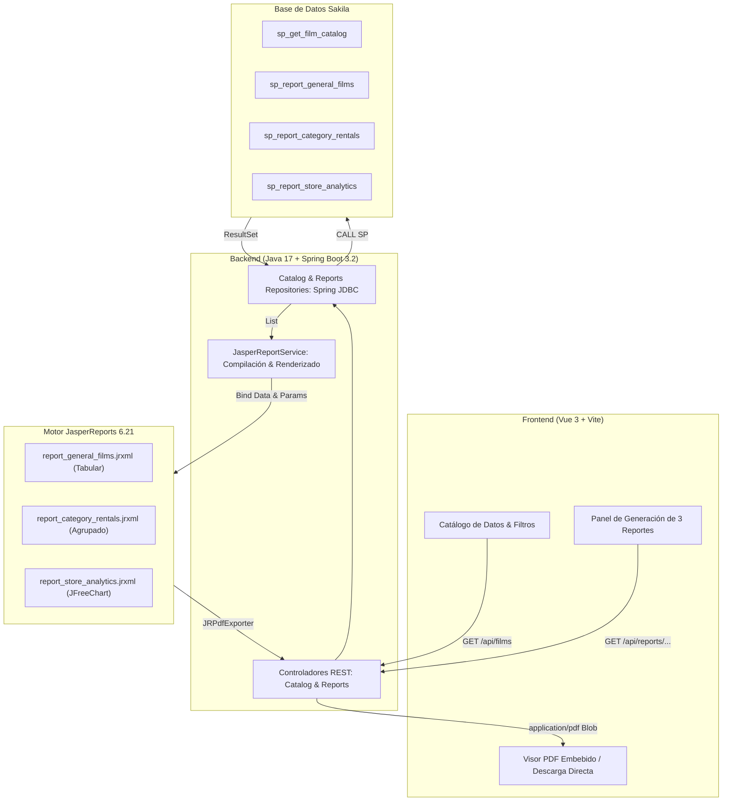

# 📊 JasperReports PoC — Integración Enterprise con Spring Boot y Vue 3

[](https://adoptium.net/)
[](https://spring.io/projects/spring-boot)
[](https://community.jaspersoft.com/)
[](https://vuejs.org/)
[](https://vitejs.dev/)
[](https://dev.mysql.com/doc/sakila/en/)

Prueba de Concepto (PoC) completa que demuestra la viabilidad técnica de generar, parametrizar y distribuir reportes empresariales utilizando **JasperReports 6.21.3** expuesto mediante servicios REST en **Java (Spring Boot 3.2)**, consumidos dinámicamente desde una aplicación web moderna en **Vue 3**, utilizando como fuente de datos relacional la base de datos de ejemplo **Sakila**.

---

## 🏗️ Arquitectura de la Solución



---

## 📁 Estructura del Repositorio

```text
├── backend/                           # API REST Spring Boot (Java 17)
│   ├── src/main/java/com/demo/jasper/
│   │   ├── config/                    # Configuración CORS
│   │   ├── controller/                # CatalogController & ReportController
│   │   ├── dto/                       # DTOs de películas y categorías
│   │   ├── repository/                # Repositorios JDBC ejecutando Stored Procedures
│   │   └── service/                   # JasperReportService (compilación, binding, exportación)
│   ├── src/main/resources/
│   │   ├── reports/                   # 3 Plantillas JasperReports (.jrxml)
│   │   │   ├── report_general_films.jrxml
│   │   │   ├── report_category_rentals.jrxml
│   │   │   └── report_store_analytics.jrxml
│   │   └── application.properties     # Configuración de puerto, DB y datasource
│   └── pom.xml                        # Dependencias Maven (Spring Boot, JasperReports, JFreeChart)
│
├── frontend/                          # Aplicación Web Vue 3 + Vite
│   ├── src/
│   │   ├── components/
│   │   │   ├── HeaderNav.vue          # Barra de navegación con badges de estado backend/DB
│   │   │   ├── FilmCatalog.vue        # Tabla interactiva con búsqueda, filtros y paginación
│   │   │   ├── ReportControlPanel.vue # Controles para parametrizar y ejecutar los 3 reportes
│   │   │   ├── PdfViewerModal.vue     # Modal con iframe para previsualizar PDFs en el navegador
│   │   │   └── ToastNotification.vue  # Notificaciones reactivas de éxito y error
│   │   ├── App.vue                    # Orquestador principal de vistas y llamadas API
│   │   ├── main.js
│   │   └── style.css                  # Sistema de diseño moderno (Glassmorphism, dark accents)
│   ├── package.json
│   └── vite.config.js
│
├── sql/                               # Scripts SQL de inicialización completa
│   ├── 01-sakila-schema.sql           # Estructura de tablas y vistas de Sakila
│   ├── 02-sakila-data.sql             # Dataset oficial de Sakila (películas, rentas, pagos)
│   ├── 03-stored-procedures.sql       # Los 4 Procedimientos Almacenados requeridos
│   └── stored_procedures.sql
│
├── docs/                              # Documentación técnica de referencia
│   ├── jasper_implementation_guide.md # Guía paso a paso de desarrollo con JasperReports
│   └── conclusiones_tecnicas_integracion_rrhh.md # Análisis de integración para RRHH
│
├── .gitignore
└── README.md
```

---

## ⚙️ Requisitos Previos

Asegúrate de tener instalados los siguientes componentes en tu entorno local:

1. **Java Development Kit (JDK)**: Versión **17** o superior ([Eclipse Temurin 17](https://adoptium.net/) recomendado).
2. **Apache Maven**: Versión **3.8+** (o utilizar el Maven Wrapper incluido en `backend/`).
3. **Node.js**: Versión **18.x** o **20.x LTS** y **npm** (v9+).
4. **Servidor MySQL o MariaDB**: Versión 8.0+ / 10.4+.

---

## 🚀 Guía de Instalación y Puesta en Marcha

### Paso 1: Clonar el Repositorio

```bash
git clone https://github.com/CardoneZ/jasperTest-PoC.git
cd jasperTest-PoC
```

---

### Paso 2: Configurar la Base de Datos Sakila y Stored Procedures

Ejecuta los scripts en orden en tu servidor MySQL o MariaDB:

#### Opción A: Mediante Línea de Comandos (CLI)

```bash
# 1. Crear la base de datos e importar el esquema
mysql -u root -p -e "CREATE DATABASE IF NOT EXISTS sakila CHARACTER SET utf8mb4 COLLATE utf8mb4_unicode_ci;"
mysql -u root -p sakila < sql/01-sakila-schema.sql

# 2. Cargar los datos de prueba de Sakila
mysql -u root -p sakila < sql/02-sakila-data.sql

# 3. Crear los 4 procedimientos almacenados
mysql -u root -p sakila < sql/03-stored-procedures.sql
```

#### Opción B: Mediante Cliente Gráfico (DBeaver, MySQL Workbench, HeidiSQL)
1. Conéctate a tu servidor MySQL.
2. Abre y ejecuta `sql/01-sakila-schema.sql`.
3. Abre y ejecuta `sql/02-sakila-data.sql`.
4. Abre y ejecuta `sql/03-stored-procedures.sql`.

> [!NOTE]
> Los 4 Procedimientos creados son:
> - `sp_get_film_catalog`: Consulta paginada multicriterio para la tabla web.
> - `sp_report_general_films`: Extracción para el Reporte 1 (Catálogo general).
> - `sp_report_category_rentals`: Extracción agrupada por categoría para el Reporte 2.
> - `sp_report_store_analytics`: Extracción analítica por tienda para el Reporte 3.

---

### Paso 3: Configurar y Ejecutar el Backend (Spring Boot)

1. **Revisar credenciales de conexión**:
   Abre el archivo [`backend/src/main/resources/application.properties`](backend/src/main/resources/application.properties) y ajusta el puerto y credenciales según tu entorno:

   ```properties
   server.port=8080

   # Ajusta el puerto (3306 ó 3307), usuario y contraseña si es necesario:
   spring.datasource.url=jdbc:mysql://127.0.0.1:3307/sakila?useSSL=false&allowPublicKeyRetrieval=true&serverTimezone=UTC&characterEncoding=UTF-8
   spring.datasource.username=root
   spring.datasource.password=
   spring.datasource.driver-class-name=com.mysql.cj.jdbc.Driver

   reports.path=classpath:reports/
   ```

2. **Compilar y levantar el servicio**:
   ```bash
   cd backend
   mvn spring-boot:run
   ```
   *(Si usas Maven Wrapper: `./mvnw spring-boot:run` en Linux/macOS o `.\mvnw.cmd spring-boot:run` en Windows)*.

3. **Verificar que el backend esté arriba**:
   Abre tu navegador o terminal y visita:
   ```bash
   curl http://localhost:8080/api/categories
   ```
   Debe responder un arreglo JSON con las 16 categorías de Sakila.

---

### Paso 4: Configurar y Ejecutar el Frontend (Vue 3)

1. En una nueva terminal, navega a la carpeta `frontend`:
   ```bash
   cd frontend
   ```

2. Instala las dependencias:
   ```bash
   npm install
   ```

3. Inicia el servidor de desarrollo Vite:
   ```bash
   npm run dev
   ```

4. Abre en tu navegador:
   👉 **`http://localhost:5173/`**

---

## 📑 Funcionalidades y Reportes Disponibles

### 1. Tabla Interactiva de Consulta
- Búsqueda en tiempo real por título o descripción con debounce.
- Filtro dropdown por Categoría (cargadas dinámicamente desde el backend).
- Filtro por Clasificación (Rating: `G`, `PG`, `PG-13`, `R`, `NC-17`).
- Paginación server-side de 10 en 10 registros respaldada por `sp_get_film_catalog`.

### 2. Los Tres Reportes JasperReports

| Reporte | Tipo / Orientación | Parámetros Disponibles | Características Técnicas en JasperReports |
|---|---|---|---|
| **Reporte 1: Catálogo General** | Tabular / Vertical (Portrait) | - Categoría<br>- Rating<br>- Mínimo de Alquileres | Encabezado corporativo, filas con sombreado cebra, resumen inferior con `REPORT_COUNT` y cálculo del promedio de tarifa (`AVERAGE`), numeración `Página X de Y`. |
| **Reporte 2: Alquileres Agrupados** | Agrupado / Vertical (Portrait) | - Ingreso Mínimo ($) | Agrupación por categoría (`<group name="CategoryGroup">`), `GroupHeader` con separador, `GroupFooter` con subtotales automáticos reiniciados por grupo y Gran Total en banda `Summary`. |
| **Reporte 3: Dashboard Ejecutivo** | Analítico / Horizontal (Landscape) | - ID de Tienda (Tienda 1 / Tienda 2) | Tarjetas KPI de resumen gerencial, matriz de rentabilidad y **Gráfico Nativo JFreeChart (`<pieChart>`)** renderizado en gráficos vectoriales de alta definición. |

### 3. Modos de Ejecución en la Interfaz
Cada tarjeta de reporte en Vue 3 incluye dos botones independientes:
- 👁️ **Vista Previa**: Descarga el reporte en memoria como blob binario y lo proyecta inmediatamente dentro de un visor modal con `iframe`, sin abandonar la aplicación.
- 💾 **Descargar PDF**: Descarga el archivo generado directamente al disco del usuario con un nombre formal y fecha (ej. `Reporte_General_Peliculas_2026-09-22.pdf`).

---

## 📡 Catálogo de Endpoints REST

| Método | Endpoint | Parámetros Query | Tipo de Respuesta | Descripción |
|:------:|----------|------------------|:-----------------:|-------------|
| `GET` | `/api/categories` | *Ninguno* | `JSON` | Listado completo de categorías para filtros. |
| `GET` | `/api/films` | `search`, `categoryId`, `rating`, `page`, `pageSize` | `JSON` | Consulta paginada y filtrada para la tabla. |
| `GET` | `/api/reports/general` | `categoryId`, `rating`, `minRentals` | `application/pdf` | Generación del Reporte 1 (Catálogo General). |
| `GET` | `/api/reports/grouped` | `minRevenue` | `application/pdf` | Generación del Reporte 2 (Alquileres Agrupados). |
| `GET` | `/api/reports/analytics` | `storeId` | `application/pdf` | Generación del Reporte 3 (Dashboard Analítico). |

---

## 📚 Documentación Técnica Detallada

Para comprender a fondo la arquitectura, decisiones de diseño y consideraciones futuras, consulta los documentos en la carpeta [`docs/`](docs/):

- 📘 **[`docs/jasper_implementation_guide.md`](docs/jasper_implementation_guide.md)**:
  Explicación técnica detallada sobre la compilación de `.jrxml`, inyección de parámetros, compatibilidad de tipos de datos en `JRMapCollectionDataSource` y consumo binario en el frontend.

- 📋 **[`docs/conclusiones_tecnicas_integracion_rrhh.md`](docs/conclusiones_tecnicas_integracion_rrhh.md)**:
  Análisis exhaustivo para la futura integración en la plataforma principal de **Gestión de Recursos Humanos (RRHH)**: recibos de nómina timbrados (CFDI), organigramas, finiquitos, precompilación y caché de `.jasper`, y arquitectura desacoplada como microservicio.

---

## 🛠️ Tecnologías Empleadas

- **Lenguaje**: Java 17 (Eclipse Temurin)
- **Framework Backend**: Spring Boot 3.2.5 (Spring Web, Spring JDBC)
- **Motor de Reportería**: JasperReports 6.21.3 + JFreeChart 1.0.19 + JCommon 1.0.23 + JasperReports Fonts 6.21.3
- **Base de Datos**: MySQL Connector/J 8.3.0 sobre base de datos Sakila
- **Frontend**: Vue 3 (Composition API, `<script setup>`), Vite 5
- **Estilos**: Vanilla CSS moderno con variables CSS, tipografías Google Fonts (*Outfit* e *Inter*), efectos glassmorphism y diseño responsivo sin librerías externas pesadas.

---

## 👥 Autores y Licencia

Desarrollado para la evaluación de viabilidad tecnológica y prueba de concepto de integración con JasperReports.
Base de datos Sakila bajo licencia BSD original de MySQL AB.
