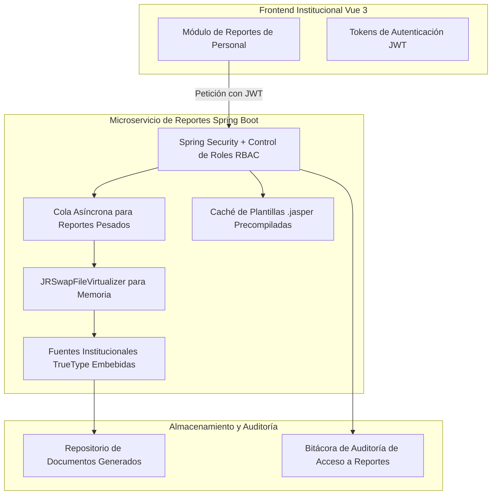

# Conclusiones y Consideraciones Técnicas para la Integración en la Plataforma de Recursos Humanos

**Documento Técnico de Evaluación y Recomendaciones**  
**Prueba de Concepto:** JasperReports con Spring Boot, Vue 3 y Base de Datos Relacional  
**Destino Futuro:** Plataforma Web de Gestión de Recursos Humanos (RRHH)

---

## 1. Conclusiones Principales de la Prueba de Concepto

La presente prueba de concepto ha demostrado la **plena viabilidad técnica y operativa** de utilizar **JasperReports** como motor de reportes integrado en un ecosistema web desacoplado con **Vue 3** en el frontend y **Spring Boot** en el backend.

### Hallazgos Clave:
1. **Separación de Responsabilidades Impecable:**
   - La base de datos encapsula la lógica de negocio y agregaciones complejas a través de **Procedimientos Almacenados (Stored Procedures)**, garantizando un rendimiento óptimo al no transferir datos crudos innecesarios.
   - El backend en **Java (Spring Boot)** actúa como orquestador seguro, validando permisos, parámetros y gestionando la compilación, llenado y exportación de las plantillas.
   - El frontend en **Vue 3** ofrece una experiencia de usuario moderna, fluida y reactiva, permitiendo filtrar información en vivo, previsualizar los documentos PDF en la misma interfaz y descargarlos sin recargar la página.

2. **Flexibilidad Visual y Estructural:**
   - Se validaron con éxito tres formatos arquitectónicos distintos:
     - **Reporte Tabular Estándar:** Ideal para listados de asistencia, catálogos y padrones de personal.
     - **Reporte Agrupado con Subtotales:** Ideal para reportes organizacionales divididos por dependencias, facultades o secretarías con totales por departamento.
     - **Dashboard Ejecutivo con Gráficos Nativos:** Empleo de componentes `<pieChart>` (JFreeChart) y tarjetas de indicadores KPI, ideal para reportes directivos de distribución de plazas, presupuesto ejercido y nómina.

3. **Compatibilidad de Ecosistema:**
   - Las plantillas `.jrxml` generadas son 100% compatibles con **Jaspersoft Studio**, lo que permite a diseñadores funcionales o analistas de negocio modelar y ajustar reportes de forma visual sin requerir despliegues de código de backend.

---

## 2. Consideraciones Técnicas para la Integración en la Plataforma Principal de Recursos Humanos

Para llevar esta arquitectura a la plataforma institucional de Recursos Humanos (UV / RRHH) en un ambiente de producción de alta disponibilidad, se deben adoptar las siguientes directrices técnicas:



---

### 2.1 Compilación Estática en Tiempo de Construcción (`.jasper`)
- **Situación en PoC:** En esta prueba los archivos `.jrxml` se compilaron en tiempo de ejecución al primer arranque.
- **Recomendación para Producción:** En entornos con miles de usuarios concurrentes, las plantillas deben compilarse estáticamente durante la fase de construcción de Maven mediante el plugin `jasperreports-maven-plugin`. Esto genera los archivos binarios `.jasper` directamente, eliminando el consumo de CPU y memoria de la compilación dinámica en el servidor.

---

### 2.2 Virtualización de Memoria para Reportes Masivos (`JRSwapFileVirtualizer`)
- **Situación en PoC:** Llenado directo en la memoria RAM de la JVM (`JasperFillManager.fillReport`).
- **Recomendación para Producción:** Reportes masivos como **Listados Generales de Nómina** o **Históricos Anuales de Asistencia** pueden superar los cientos de miles de páginas. Para evitar errores de memoria (`java.lang.OutOfMemoryError`), se debe configurar un `JRSwapFileVirtualizer` o `JRGzipVirtualizer`:
  ```java
  JRSwapFile swapFile = new JRSwapFile("/tmp/jasper_swap", 1024, 100);
  JRSwapFileVirtualizer virtualizer = new JRSwapFileVirtualizer(200, swapFile, true);
  parameters.put(JRParameter.REPORT_VIRTUALIZER, virtualizer);
  ```
  Esto descarga páginas inactivas a disco de manera transparente, manteniendo el consumo de memoria plano sin importar el tamaño del reporte.

---

### 2.3 Paquete de Fuentes Institucionales (Entornos Linux / Docker Headless)
- **Problema Conocido:** Los servidores de aplicaciones en contenedores Linux (Docker, Kubernetes) no incluyen las fuentes de Microsoft o macOS (Arial, Helvetica, Calibri). Si un reporte requiere una fuente no instalada, JasperReports recurre a fuentes por defecto que pueden desalinear tablas y textos.
- **Solución Obligatoria:** Empaquetar las fuentes institucionales como una **Extensión de Fuentes de JasperReports** dentro del `JAR` del backend:
  1. Definir `fonts.xml` con los archivos `.ttf` incluidos en `src/main/resources/fonts/`.
  2. Declarar `net.sf.jasperreports.extension.registry.factory.fonts=net.sf.jasperreports.engine.fonts.SimpleFontExtensionsRegistryFactory` en `jasperreports_extension.properties`.
  3. Asegurar que las propiedades de exportación incluyan `isPdfEmbedded="true"`.

---

### 2.4 Control de Acceso Basado en Roles (RBAC) y Confidencialidad
- La información de Recursos Humanos es de alta confidencialidad (sueldos, deducciones, actas administrativas).
- Los endpoints de generación de reportes deben estar protegidos mediante **Spring Security** y validación de tokens **JWT / OAuth2**.
- Cada reporte debe registrarse en una **Bitácora de Auditoría** institucional, guardando:
  - Usuario que generó el reporte.
  - Filtros y parámetros utilizados.
  - Sello de tiempo y dirección IP de origen.
  - Hash criptográfico del documento generado para control de no repudio.

---

### 2.5 Subreportes para Estructuras Complejas (Recibos de Nómina y Expedientes)
- Para documentos complejos como los **Talones de Pago / Recibos de Nómina**, que combinan:
  1. Datos del empleado y nombramiento (encabezado).
  2. Percepciones (subreporte 1).
  3. Deducciones institucionales y préstamos (subreporte 2).
  4. Resumen neto y código de barras / firma digital (pie).
- Se recomienda el uso de componentes `<subreport>` parametrizados, permitiendo reutilizar subplantillas independientes y facilitando el mantenimiento modular.

---

### 2.6 Exportación Multiformato (Excel / CSV)
- Además del formato PDF institucional para impresión oficial, los usuarios del área de Finanzas y Recursos Humanos frecuentemente requieren analizar los datos en hojas de cálculo.
- La biblioteca JasperReports permite reutilizar la misma plantilla `.jasper` para exportar a **Microsoft Excel (`.xlsx`)** mediante `JRXlsxExporter`:
  - Se debe configurar la propiedad `net.sf.jasperreports.export.xls.detect.cell.type=true` para que fechas y números sean reconocidos nativamente como celdas de cálculo y no como texto.
  - Configurar `net.sf.jasperreports.export.xls.remove.empty.space.between.rows=true` para evitar filas en blanco innecesarias.

---

### 2.7 Procesamiento Asíncrono para Grandes Volúmenes
- Cuando un reporte tome más de 5 a 10 segundos en generarse (ej. nómina general universitaria), no se debe mantener la conexión HTTP sincrónica bloqueada.
- **Patrón Recomendado:**
  1. El cliente envía la solicitud: `POST /api/reports/nomina-general`.
  2. El servidor responde inmediatamente `HTTP 202 Accepted` con un identificador de tarea (`jobId`).
  3. Un worker en segundo plano (Spring `@Async` o cola RabbitMQ/Kafka) procesa el reporte y almacena el archivo en un almacenamiento de objetos (Amazon S3 / MinIO).
  4. La aplicación en Vue 3 recibe notificación vía WebSocket o sondeo corto y muestra el botón de descarga cuando el reporte está listo.

---

## 3. Resumen Ejecutivo de la Evaluación

| Criterio | Evaluación PoC | Viabilidad para RRHH |
| :--- | :--- | :--- |
| **Calidad y Presentación Visual** | Excelente (diseño corporativo, tipografía moderna, gráficos) | **Aprobada** |
| **Rendimiento de Generación** | < 250 ms en reportes medianos (< 1,000 registros) | **Aprobada** |
| **Integración con Vue 3** | Transparente vía Blobs binarios y modales reactivos | **Aprobada** |
| **Separación de Lógica (SPs)** | 100% encapsulada en la base de datos | **Aprobada** |
| **Facilidad de Mantenimiento** | Alta mediante Jaspersoft Studio visual | **Aprobada** |

**Conclusión:** Se recomienda plenamente la adopción de **JasperReports** para la plataforma principal de Recursos Humanos, siguiendo las pautas de compilación estática, empaquetado de fuentes institucionales y virtualización de memoria descritas en este documento.
