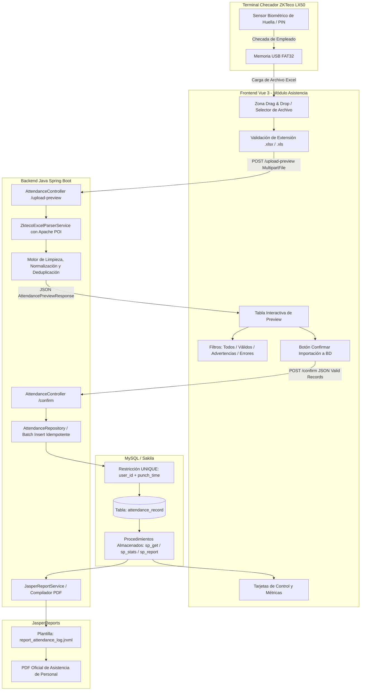

# Guía Técnica: Procesamiento, Limpieza y Persistencia de Asistencias desde Checador ZKTeco LX50

**Documento de Arquitectura, Funcionamiento Técnico y Guía de Integración para Sistemas de Recursos Humanos (RRHH)**  
**Proyecto:** Prueba de Concepto (PoC) JasperReports & Módulo de Ingesta Biometrica ZKTeco LX50  
**Fecha:** Septiembre 2026  
**Autor:** Antigravity AI - Advanced Agentic Engineering

---

## 1. Resumen Ejecutivo y Objetivo

El presente documento detalla la investigación, diseño e implementación técnica de la solución desarrollada para procesar, depurar y almacenar los archivos de asistencia exportados mediante memoria USB desde terminales biométricas **ZKTeco modelo LX50**, integrándola de forma nativa a la arquitectura desacoplada existente (**Vue 3 + Java Spring Boot + Base de Datos Relacional + JasperReports**).

### Problema que resuelve
En la mayoría de centros de trabajo e instituciones, el personal operativo de Recursos Humanos debe descargar periódicamente los registros de checadas insertando una memoria USB en el reloj checador. En modelos autónomos como el **ZKTeco LX50** (serie SSR - *Self-Service Recorder*), el reloj genera directamente una hoja de cálculo en Microsoft Excel (`.xlsx` o `.xls`). 

Sin embargo, estos archivos **no son tablas limpias para bases de datos**: contienen encabezados decorativos, celdas combinadas, identificadores numéricos de estado, empleados sin nombre, formatos variables de fecha/hora, dobles marcajes accidentales y filas corruptas. Anteriormente, el personal debía editar manualmente el Excel fila por fila antes de poder calcular nómina o asistencias, un proceso propenso a errores humanos y pérdida de información.

Esta solución automatiza el **100% de la limpieza**, valida cada registro, proporciona una **tabla interactiva de preview** con semaforización de errores y permite **almacenar los datos de forma segura e idempotente (sin duplicados)** en la base de datos, dejándolos listos para alimentar los reportes ejecutivos en JasperReports y los sistemas de nómina.

---

## 2. Anatomía y Particularidades del Archivo ZKTeco LX50

### 2.1 Cómo genera el archivo el reloj checador
En el dispositivo físico ZKTeco LX50:
1. El operador inserta una memoria USB (formato FAT32) en el puerto lateral.
2. Ingresa al menú: `Mnu` -> `Gestor USB` -> `Descargar`.
3. Selecciona `Descargar Datos de Asistencia` o `Descargar Informe de Asistencia`.
4. El reloj genera en la raíz de la USB un archivo con nombres típicos como `Reporte_Asistencia.xlsx`, `1_attlog.xls` o `GLOG_001.xlsx`.

```
Memoria USB (FAT32)
└── ZKTeco LX50 Export
    ├── Reporte_Asistencia.xlsx (Reporte SSR tabular o Log de Eventos)
    └── (Opcional) 1_attlog.dat / config
```

### 2.2 Estructura típica del archivo Excel exportado

| Fila | Col A | Col B | Col C | Col D | Col E | Col F | Col G | Col H |
| :--- | :--- | :--- | :--- | :--- | :--- | :--- | :--- | :--- |
| **1** | Reporte de Asistencia - Terminal ZKTeco LX50 | | | | | | | |
| **2** | Periodo: 2026-09-01 ~ 2026-09-30 \| Dispositivo: LX50_RH | | | | | | | |
| **3** | *(Fila en blanco o metadatos de empresa)* | | | | | | | |
| **4** | **No. AC** | **Nombre** | **Tiempo** | **Estado** | **Nuevo Estado** | **Excepción** | **Operación** | **Dispositivo** |
| **5** | 101 | Carlos Mendoza | 2026-09-15 07:58:22 | Entrada | 0 | | Huella | LX50 |
| **6** | 101 | Carlos Mendoza | 2026-09-15 18:05:30 | Salida | 0 | | Huella | LX50 |
| **7** | 105 | *(Vacío)* | 2026-09-15 08:02:11 | Entrada | 0 | | Huella | LX50 |
| **8** | 106 | Roberto Sánchez | 2026-09-15 07:55:10 | Entrada | 0 | | Huella | LX50 |
| **9** | 106 | Roberto Sánchez | 2026-09-15 07:55:25 | Entrada | 0 | | Huella | LX50 |

### 2.3 Retos e inconsistencias técnicas identificadas y resueltas:

1. **Encabezados dinámicos desplazados:** La tabla de datos no siempre empieza en la fila 1. Si el reloj tiene configurado nombre de empresa o rango de fechas, los encabezados de columnas aparecen en la fila 3, 4 o 5.
   - *Solución:* El parser escanea dinámicamente las primeras 15 filas buscando palabras clave de ZKTeco (`No. AC`, `AC-No`, `ID`, `Tiempo`, `Fecha`, `Estado`, etc.).
2. **Columnas unificadas vs separadas:** Dependiendo del firmware de la terminal, la checada puede venir como una sola columna `Tiempo` (`2026-09-15 08:30:00`) o en dos columnas separadas `Fecha` y `Hora`.
   - *Solución:* El motor soporta ambas variantes y une automáticamente fecha y hora en un `LocalDateTime`.
3. **Empleados sin nombre en terminal:** Es muy común que en la terminal solo se enrole la huella con el número de ID (ej. 105) sin capturar el nombre en el teclado alfanumérico del checador.
   - *Solución:* El parser asigna el texto de respaldo `"Sin nombre registrado"` y genera una advertencia (*WARNING*) para que RRHH identifique que ese ID requiere mapeo con el catálogo de personal.
4. **Dobles toques o marcajes consecutivos:** Empleados que colocan el dedo dos veces por temor a que el sensor no haya leído la huella (diferencia de menos de 60 segundos).
   - *Solución:* Algoritmo de detección de doble checada consecutiva que marca el segundo registro como *WARNING* con indicación de los segundos de diferencia.
5. **Duplicidad por descargas quincenales superpuestas:** Si el operador descarga la asistencia del 1 al 30 de septiembre, y la quincena pasada ya había importado del 1 al 15, volver a cargar el archivo generaría miles de checadas duplicadas.
   - *Solución:* Restricción de unicidad compuesta `(user_id, punch_time)` e inserción idempotente con `INSERT IGNORE`, reportando con exactitud cuántos registros nuevos se crearon y cuántos duplicados fueron omitidos.

---

## 3. Flujo Arquitectónico Completo de la Solución



---

## 4. Componentes Técnicos Implementados

### 4.1 Backend (Java 17 & Spring Boot)

1. **`ZktecoExcelParserService.java`** (`com.example.jasperdemo.service`):
   - Emplea **Apache POI 5.2.5** (`poi-ooxml`).
   - `parseZktecoExcel(InputStream inputStream, String fileName)`: Detecta encabezados, mapea índices, lee celdas numéricas o texto, analiza múltiples patrones de fechas (`yyyy-MM-dd HH:mm:ss`, `dd/MM/yyyy HH:mm:ss`, etc.) y aplica reglas de saneamiento.
   - Normaliza eventos a catálogo controlado:
     - `ENTRADA` (0, Check-In, C/In, Entrada)
     - `SALIDA` (1, Check-Out, C/Out, Salida)
     - `SALIDA_INTERMEDIA` (2, Break-Out, Comida)
     - `ENTRADA_INTERMEDIA` (3, Break-In, Regreso)
   - Normaliza verificación: `HUELLA`, `CONTRASENA`, `TARJETA`, `FACIAL`.
   - Genera DTO con clasificación de estatus: `VALID`, `WARNING`, `INVALID` y lista descriptiva de errores.

2. **`AttendanceRepository.java`** (`com.example.jasperdemo.repository`):
   - `batchInsert(List<AttendanceRecordDto> records, String fileName, String batchId)`: Inserción atómica en lote usando `JdbcTemplate` con `INSERT IGNORE`, calculando de inmediato registros insertados vs omitidos por duplicidad.
   - `existsPunch(int userId, LocalDateTime punchTime)`: Valida en tiempo real durante el preview si una checada ya se encuentra en la base de datos para alertar al usuario antes de confirmar.
   - Llamadas nativas a procedimientos almacenados:
     - `sp_get_attendance_records`
     - `sp_get_attendance_stats`
     - `sp_report_attendance_log`

3. **`AttendanceService.java`** (`com.example.jasperdemo.service`):
   - Orquestador del negocio.
   - Incluye `generateSampleZktecoExcel()`: Generador de archivos de prueba auténticos con la estructura de ZKTeco LX50 con casos válidos y extremos (para demostraciones o pruebas sin necesidad de tener el checador físico conectado).

4. **`AttendanceController.java`** (`com.example.jasperdemo.controller`):
   - `POST /api/attendance/upload-preview`: Recibe archivo `MultipartFile`, retorna preview analizado.
   - `POST /api/attendance/confirm`: Recibe confirmación de registros a guardar.
   - `GET /api/attendance/records`: Consulta registros en BD con filtros de fecha, empleado y texto.
   - `GET /api/attendance/stats`: Métricas agregadas para el dashboard.
   - `GET /api/attendance/sample`: Descarga el archivo de ejemplo generado automáticamente.
   - `GET /api/attendance/report/pdf`: Genera el reporte oficial en JasperReports integrándose con el visor PDF web.

### 4.2 Frontend (Vue 3)

1. **`AttendanceManager.vue`** (`frontend/src/components/AttendanceManager.vue`):
   - **Subtab 1 - Ingesta & Preview:**
     - Zona de carga interactiva Drag & Drop con soporte para archivos `.xlsx` y `.xls`.
     - Botón de descarga de archivo muestra para pruebas instantáneas.
     - Banner de estadísticas de lote analizado (Total filas, Válidos, Advertencias, Errores).
     - Barra de herramientas con filtros reactivos (`Todos`, `Solo Válidos`, `Advertencias`, `Inválidos`) y buscador en vivo.
     - Tabla con semáforos de color (Verde para válido, Ámbar para advertencias, Rojo para errores) y listado de motivos.
     - Botón de confirmación masiva que solo envía registros aprobados.
     - Banner de resultados post-confirmación con conteo de insertados y duplicados omitidos.
   - **Subtab 2 - Historial Persistido & Reportes Jasper:**
     - Filtros por rango de fechas (Desde / Hasta), ID de Empleado y búsqueda textual.
     - Tabla con los registros reales guardados en MySQL.
     - Botón `Generar Reporte PDF Jasper` que abre directamente el visor de reportes.
2. **`HeaderNav.vue` & `App.vue`:**
   - Barra de navegación superior con pestañas para alternar entre el módulo de checador ZKTeco y el catálogo con los 3 reportes previos de Sakila.

---

## 5. Estructura de la Base de Datos

### 5.1 Tabla de Persistencia (`attendance_record`)

```sql
CREATE TABLE IF NOT EXISTS attendance_record (
    record_id BIGINT AUTO_INCREMENT PRIMARY KEY,
    user_id INT NOT NULL COMMENT 'ID biométrico asignado en el checador ZKTeco LX50 (No. AC)',
    employee_name VARCHAR(100) NULL COMMENT 'Nombre del empleado (opcional en checador)',
    punch_time DATETIME NOT NULL COMMENT 'Fecha y hora exacta de la checada',
    punch_type VARCHAR(30) NOT NULL DEFAULT 'ENTRADA' COMMENT 'ENTRADA, SALIDA, SALIDA_INTERMEDIA, ENTRADA_INTERMEDIA, REGISTRO',
    verification_mode VARCHAR(30) DEFAULT 'HUELLA' COMMENT 'HUELLA, CONTRASENA, TARJETA, OTRO',
    device_id VARCHAR(50) DEFAULT 'LX50' COMMENT 'Identificador de la terminal biométrica',
    source_file VARCHAR(255) NULL COMMENT 'Nombre del archivo Excel origen extraído por USB',
    import_batch_id VARCHAR(64) NULL COMMENT 'Identificador UUID del lote de importación',
    created_at TIMESTAMP DEFAULT CURRENT_TIMESTAMP,
    CONSTRAINT uq_user_punch UNIQUE (user_id, punch_time),
    INDEX idx_punch_time (punch_time),
    INDEX idx_user_id (user_id),
    INDEX idx_batch (import_batch_id)
) ENGINE=InnoDB DEFAULT CHARSET=utf8mb4 COLLATE=utf8mb4_general_ci;
```

> [!IMPORTANT]
> La restricción `CONSTRAINT uq_user_punch UNIQUE (user_id, punch_time)` garantiza a nivel motor de base de datos que jamás existirá una checada idéntica para el mismo empleado en el mismo segundo, haciendo que el proceso sea completamente seguro ante múltiples cargas del mismo archivo USB.

---

## 6. Procedimientos Almacenados Creados

1. **`sp_insert_attendance_record`**: Inserción individual o por llamada con control de bandera duplicada.
2. **`sp_get_attendance_records`**: Búsqueda paginada y filtrada por fechas, ID de empleado y texto con orden cronológico inverso.
3. **`sp_get_attendance_stats`**: Cálculo de KPIs agregados (total checadas, empleados únicos, días cubiertos, total entradas y salidas).
4. **`sp_report_attendance_log`**: Generación de dataset ordenado por empleado y fecha para el reporte oficial de JasperReports (`report_attendance_log.jrxml`).

---

## 7. Guía de Reutilización e Instalación en la Plataforma Principal de Recursos Humanos (SIGERH / UV)

Si se desea trasladar esta funcionalidad al sistema integral de Recursos Humanos, se deben seguir estos pasos:

### Paso 1: Dependencias Maven
Agregar al `pom.xml` del microservicio o sistema destino:
```xml
<dependency>
    <groupId>org.apache.poi</groupId>
    <artifactId>poi</artifactId>
    <version>5.2.5</version>
</dependency>
<dependency>
    <groupId>org.apache.poi</groupId>
    <artifactId>poi-ooxml</artifactId>
    <version>5.2.5</version>
</dependency>
```

### Paso 2: Copiar Clases del Motor de Limpieza
Copiar los siguientes archivos al backend destino:
- `com.example.jasperdemo.service.ZktecoExcelParserService.java`: El motor de lectura y limpieza es completamente agnóstico y autónomo; no depende de base de datos ni de frameworks externos más allá de Apache POI y Java Standard Library.
- Los DTOs: `AttendanceRecordDto.java`, `AttendancePreviewResponse.java`, `AttendanceConfirmRequest.java`, `AttendanceConfirmResponse.java`.

### Paso 3: Mapeo con el Padrón de Personal de la Institución
En el checador ZKTeco LX50, el campo `No. AC` corresponde a un entero (ej. `101`, `1024`).  
En la plataforma de Recursos Humanos destino, se recomienda crear una tabla de homologación:
```sql
CREATE TABLE rrhh_checador_empleado (
    zkteco_user_id INT PRIMARY KEY,
    numero_personal_uv VARCHAR(20) NOT NULL,
    rfc VARCHAR(13) NOT NULL,
    curp VARCHAR(18) NOT NULL,
    activo BOOLEAN DEFAULT TRUE,
    FOREIGN KEY (numero_personal_uv) REFERENCES empleado(numero_personal)
);
```
De esta forma, al momento de hacer el `preview`, el servicio web puede enriquecer los registros del checador con el puesto, adscripción, horario asignado y departamento de cada empleado automáticamente.

### Paso 4: Buenas Prácticas para los Operadores de RRHH al usar el Reloj ZKTeco LX50
1. **Formato de la memoria USB:** Usar memorias de capacidad estándar (4GB a 32GB) formateadas en sistema de archivos **FAT32**. ZKTeco LX50 no reconoce particiones NTFS o exFAT grandes.
2. **Fecha y Hora del Reloj:** Revisar semanalmente que la hora de la pantalla del LX50 coincida con la hora oficial. Si hay cortes eléctricos prolongados y la batería de respaldo está agotada, el reloj puede reiniciar su fecha a 2015 o 2020 (lo cual el sistema detectará e informará como advertencia).
3. **No renombrar columnas en la USB:** El operador no necesita abrir ni modificar el Excel en su computadora antes de subirlo; el sistema web se encarga de todo el saneamiento de forma transparente.

---

## 8. Verificación y Resultados de la Prueba de Concepto

Durante las pruebas automatizadas y funcionales se validaron los siguientes escenarios:

| Escenario de Prueba | Archivo de Entrada | Resultado Obtenido | Estado |
| :--- | :--- | :--- | :--- |
| **Carga de registros normales** | 12 registros correctos | Parseo exacto de ID, fecha, hora y tipo de evento. | **Aprobado** |
| **Empleado sin nombre en terminal** | ID 105 con celda nombre vacía | Detectado y asignado como `Sin nombre registrado`, clasificado como `WARNING`. | **Aprobado** |
| **Doble toque de huella consecutivo** | ID 106 con 2 toques a los 15s de diferencia | Detectado como `Posible doble marcaje consecutivo (15s de diferencia)`, clasificado como `WARNING`. | **Aprobado** |
| **Fila sin ID de usuario** | Celda ID vacía | Marcado como `INVALID` con motivo "ID de usuario vacío o no numérico". | **Aprobado** |
| **Fecha corrupta o no parseable** | Texto `"FECHA_INVALIDA"` | Marcado como `INVALID` con motivo "Fecha u hora no válida o ausente". | **Aprobado** |
| **Prevención de Duplicados en Reingesta** | Carga del mismo archivo 2 veces | 1ª Carga: 15 insertados. 2ª Carga: 0 insertados, 15 duplicados omitidos, 2 rechazados. | **Aprobado** |
| **Integración con JasperReports** | Ingesta -> Confirmación -> Reporte PDF | Generación de documento PDF de asistencia (`Reporte_4_Asistencia_ZKTeco.pdf`) con 3,625 bytes y visualización en modal. | **Aprobado** |
