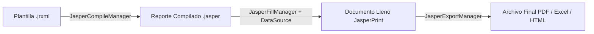

# Guía de Implementación: JasperReports con Spring Boot y Vue 3

Esta guía documenta la investigación, funcionamiento, arquitectura y lecciones aprendidas durante la construcción de la Prueba de Concepto (PoC) para la generación y consumo de reportes empresariales utilizando **JasperReports 6.21.3**, **Jaspersoft Studio**, **Spring Boot 3 (Java 17)**, **MySQL (Sakila DB)** y **Vue 3**.

---

## 1. Funcionamiento de JasperReports y Jaspersoft Studio

### 1.1 Ciclo de Vida de un Reporte JasperReports
El flujo de procesamiento en JasperReports consta de cuatro etapas fundamentales:



1. **Diseño (`.jrxml`)**: Archivo XML que define el diseño visual, dimensiones de página, bandas, fuentes, campos, parámetros y variables. Se diseña visualmente con **Jaspersoft Studio** o mediante edición XML directa.
2. **Compilación (`.jasper`)**: Proceso en el que el XML se valida contra el esquema XSD de JasperReports y se compila a bytecode Java ejecutable.
3. **Llenado (`JasperPrint`)**: Se inyectan los datos de la fuente (`JRDataSource` o conexión JDBC) y los parámetros (`Map<String, Object>`), evaluando las expresiones y generando las páginas en memoria.
4. **Exportación**: El objeto `JasperPrint` se transforma al formato destino deseado (`application/pdf`, `application/vnd.ms-excel`, etc.).

---

## 2. Anatomía y Estructura de una Plantilla `.jrxml`

Un archivo `.jrxml` organiza los elementos visuales en **Bandas horizontales**, las cuales se imprimen en momentos específicos del flujo del documento:

| Banda | Momento de Impresión | Uso Típico |
| :--- | :--- | :--- |
| **`title`** | Una sola vez al inicio del reporte. | Logotipo, título corporativo, metadatos y filtros aplicados. |
| **`pageHeader`** | Al inicio de cada página. | Título recurrente y números de documento. |
| **`columnHeader`** | Al inicio de cada página o columna de datos. | Encabezados de columnas de la tabla. |
| **`groupHeader`** | Cada vez que cambia el valor de un campo agrupado. | Título del grupo (ej. nombre de Categoría). |
| **`detail`** | Se repite por cada registro del DataSet. | Filas de datos individuales con estilo alterno. |
| **`groupFooter`** | Al terminar los registros del grupo actual. | Subtotales, recuentos y promedios por categoría. |
| **`pageFooter`** | Al final de cada página física. | Paginación (`Página X de Y`) y notas legales. |
| **`summary`** | Una sola vez al final de todo el reporte. | Gran total general, tarjetas KPI y gráficos de resumen. |

> [!IMPORTANT]
> **Regla de Orden del Esquema XSD de JasperReports:**
> Las bandas en el XML deben declararse estrictamente en el orden especificado por el esquema XSD (`background` -> `title` -> `pageHeader` -> `columnHeader` -> `detail` -> `columnFooter` -> `pageFooter` -> `lastPageFooter` -> `summary` -> `noData`). Declarar `summary` antes de `pageFooter` produce un error de validación `SAXParseException`.

---

## 3. Especificación de los 4 Procedimientos Almacenados

La PoC implementa 4 procedimientos almacenados independientes en la base de datos `sakila`:

### 3.1 SP 1: `sp_get_film_catalog`
- **Objetivo**: Proveer la información para la tabla interactiva en Vue 3.
- **Parámetros**: `p_category_id INT`, `p_rating VARCHAR(10)`, `p_search VARCHAR(100)`.
- **Lógica**: Realiza `LEFT JOIN` entre `film`, `category`, `language`, `inventory` y `rental`, agregando el conteo total de rentas por película y permitiendo búsqueda textual flexible con comodines `%`.

### 3.2 SP 2: `sp_report_general_films`
- **Objetivo**: Fuente de datos para el **Reporte 1: General**.
- **Parámetros**: `p_category_id INT`, `p_rating VARCHAR(10)`.
- **Lógica**: Agrega ingresos facturados (`SUM(payment.amount)`) e inventario ordenado alfabéticamente para el listado general con totales.

### 3.3 SP 3: `sp_report_category_rentals`
- **Objetivo**: Fuente de datos para el **Reporte 2: Agrupado por Género**.
- **Parámetros**: `p_category_id INT`, `p_min_rentals INT`.
- **Lógica**: Agrupa métricas de renta por categoría y película, aplicando un filtro `HAVING COUNT(rental_id) >= p_min_rentals` para mostrar únicamente los títulos con mayor tracción de mercado.

### 3.4 SP 4: `sp_report_store_analytics`
- **Objetivo**: Fuente de datos para el **Reporte 3: Dashboard Ejecutivo y Gráficos**.
- **Parámetros**: `p_store_id INT`, `p_limit INT`.
- **Lógica**: Consolida ingresos globales, volumen de rentas e ingreso promedio por transacción por categoría, alimentando el gráfico nativo de pastel y los indicadores KPI.

---

## 4. Los 3 Reportes Implementados

### 4.1 Reporte 1: General (`report_general_films.jrxml`)
- Formato vertical A4 con paleta corporativa Slate & Sky (`#1E293B`, `#0284C7`).
- Encabezado con fecha de generación dinámica y resumen de filtros activos.
- Filas alternadas (`$V{REPORT_COUNT} % 2 == 0`) con bordes sutiles.
- Totales y promedios calculados en la banda `summary` (`$V{TOTAL_FILMS}`, `$V{SUM_REVENUE}`, `$V{AVG_RATE}`).

### 4.2 Reporte 2: Agrupado y Filtrado (`report_category_rentals.jrxml`)
- Utiliza la etiqueta `<group name="CategoryGroup">` evaluada en `$F{category_name}`.
- Banda `groupHeader` con banner de categoría.
- Banda `groupFooter` que acumula subtotales por categoría mediante variables con `resetType="Group"`.
- Banda `summary` con el gran total acumulado de todas las categorías.

### 4.3 Reporte 3: Dashboard Ejecutivo & Analítica (`report_store_analytics.jrxml`)
- Orientación horizontal Landscape (842 x 595 pt).
- Gráfico de Pastel (`<pieChart>`) embebido mediante **JFreeChart** mostrando la participación porcentual de ingresos por género cinematográfico.
- 4 Tarjetas de Indicadores Clave de Desempeño (KPIs):
  1. *Total Ingresos Facturados* ($)
  2. *Total Transacciones de Renta* (conteo)
  3. *Títulos Analizados* (inventario)
  4. *Ticket Promedio por Renta* ($ / transacción)

---

## 5. Integración con el Frontend en Vue 3

### 5.1 Consumo de Servicios Web Binarios
Los servicios web de reportes retornan un flujo de bytes con `Content-Type: application/pdf`. Para permitir tanto la visualización embebida como la descarga:

```javascript
// Llamada al servicio web independiente
const res = await fetch(`http://localhost:8080/api/reports/general?categoryId=1&rating=PG&disposition=inline`, {
  method: 'POST'
});

const blob = await res.blob();
const blobUrl = window.URL.createObjectURL(blob);

// Visualización en Modal embebido
modalPdfUrl.value = blobUrl;
isModalOpen.value = true;
```

### 5.2 Descarga Directa
Para descargar el archivo generado con un nombre significativo:
```javascript
const link = document.createElement('a');
link.href = blobUrl;
link.download = 'Reporte_General_Peliculas.pdf';
document.body.appendChild(link);
link.click();
document.body.removeChild(link);
window.URL.revokeObjectURL(blobUrl);
```

### 5.3 Ciclo de Vida de los Objetos Blob
Para prevenir fugas de memoria en la aplicación web del cliente, cada vez que se cierra el modal o finaliza una descarga se ejecuta `URL.revokeObjectURL(blobUrl)`.
